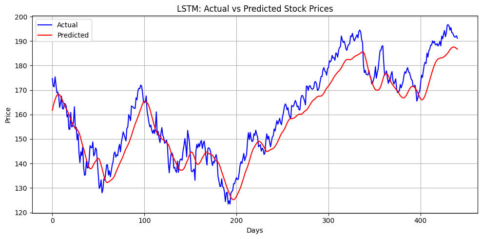

# 📊 Stock Price Predictor using LSTM

This project predicts the **closing stock price** of a company using **LSTM (Long Short-Term Memory)** neural networks.

## 🧠 Technologies Used
- Python
- TensorFlow/Keras
- Scikit-learn
- Yahoo Finance API
- Matplotlib

## 📈 Dataset
The historical stock data is pulled using [`yfinance`](https://pypi.org/project/yfinance/).

## 🚀 How to Run

1. Open `stock_lstm_predictor.ipynb` in Google Colab
2. Run all cells — this will:
   - Download stock data
   - Preprocess and scale it
   - Train an LSTM model
   - Plot actual vs predicted prices

## **📷 Output**

You will see a graph similar to this:




## 📦 Requirements

Install using pip:

```bash
pip install -r requirements.txt
```
## **📷 Output**

You will see a graph similar to this:


